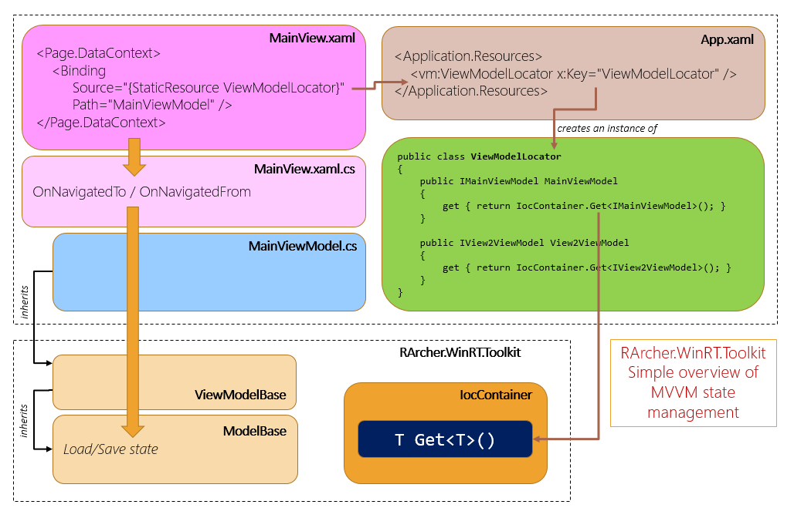
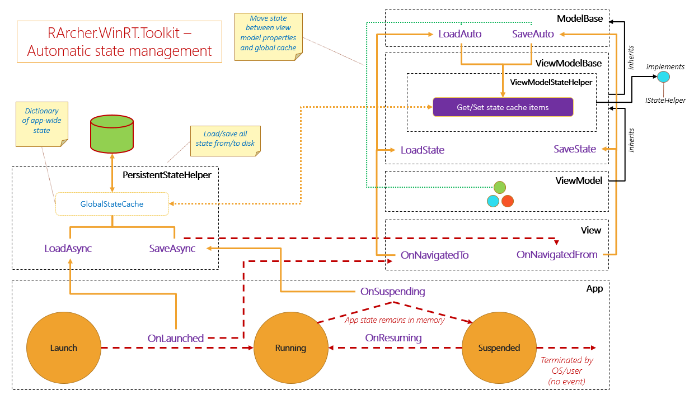

# RArcher.UAP.Toolkit
Framework used in the creation of WinRT-based Windows and Windows Phone apps.

Archived Visual Studio 2015 project that was previously held in Team Foundation Server.

As of May 21st 2016, support for this toolkit has been discontinued.

 

## What is it?

RArcher.WinRT.Toolkit is an experimental lightweight toolkit for creating Universal WinRT 8.1 apps, based on the MVVM design pattern.

The toolkit was originally designed for WP8 as a set of reusable classes for use with the roundup app, with the intention being that these classes be generically reusable in future WP8 projects. After the initial release of roundup, I decided to refactor all the reusable stuff into a collection of toolkit packages which became RArcher.Phone.Toolkit. With the release of WinRT 8.1 I refactored the toolkit and renamed it RArcher.WinRT.Toolkit.

An obvious question at this point is, "Why don't you use MVVM Light, Caliburn Micro, or a similar well-established MVVM framework?" The answer is simple: I want the knowledge and insights to be gained from creating my own (simple) MVVM framework.

So, is my toolkit a "better" alternative to MVVM Light? No, definitely not! If you want an industry-standard MVVM-enabling toolkit for WinRT projects, you should go for MVVM Light.

However, by creating RArcher.Phone.Toolkit and RArcher.WinRT.Toolkit, I did gain a better understanding of what it takes to create MVVM-based apps for Windows 8.1 and Windows Phone 8.1. And the toolkit also provides some useful things I haven't seen elsewhere.

I've found maintaining app state to be an error-prone chore. The toolkit provides classes which enables view models and other models to automatically save/restore properties as and when required. For example, all you need to do is decorate a view model property with the [AutoState] attribute and ViewModelBase and ModelBase take care of all the load/save mechanics. I did a write-up on the principles of the mechanism previously. In version 1.3-onwards, the toolkit also supports the automatic management of global settings.
